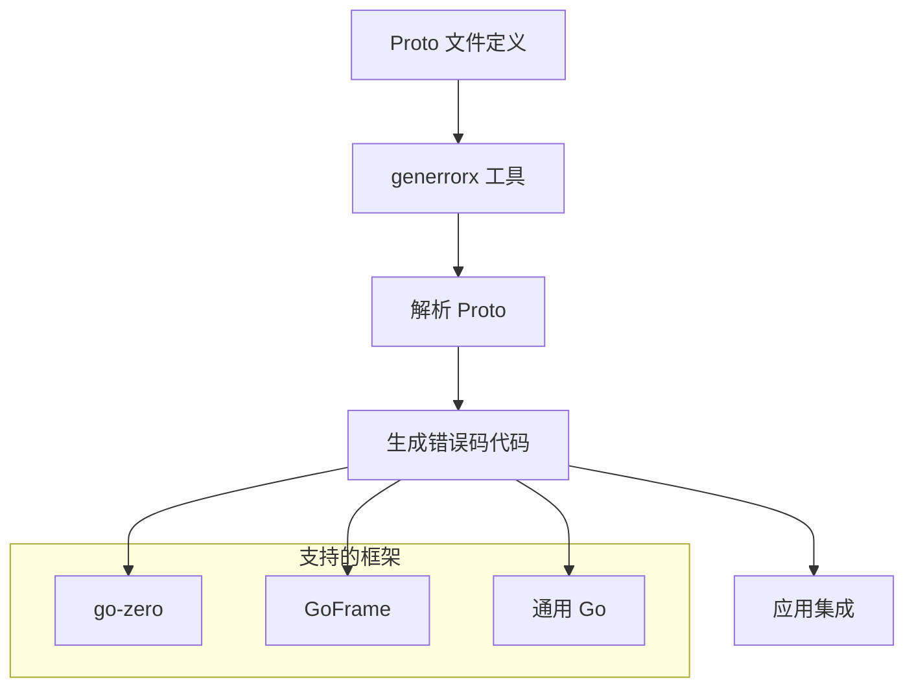
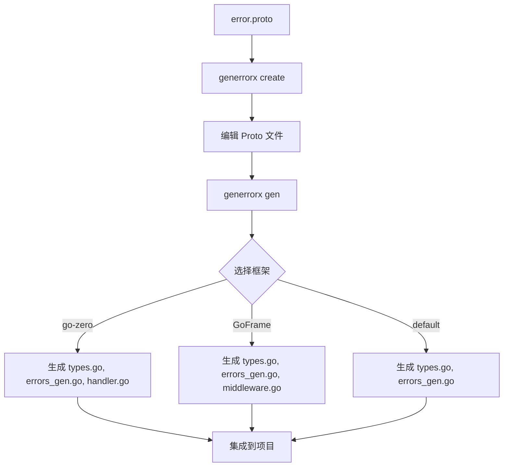

# generrorx 工作流程

## 整体架构



## 错误处理流程

```mermaid
graph LR
    A[业务逻辑] --> B{错误类型判断}
    B -->|业务错误| C[@http 标记]
    B -->|系统错误| D[无 @http 标记]
    C --> E[HTTP 状态码 + 错误消息]
    D --> F[HTTP 500 + 服务繁忙]
    E --> G[前端显示]
    F --> G
```

## 代码生成流程



## 错误码映射关系

```mermaid
graph TB
    subgraph "Proto 定义"
        A[USER_NOT_FOUND = 10001 @http=404]
        B[DB_CONNECT_FAILED = 20001]
    end
    
    subgraph "生成的代码"
        C[ErrUserNotFound]
        D[ErrDbConnectFailed]
    end
    
    subgraph "HTTP 响应"
        E[404 Not Found]
        F[500 Internal Server Error]
    end
    
    A --> C
    B --> D
    C --> E
    D --> F